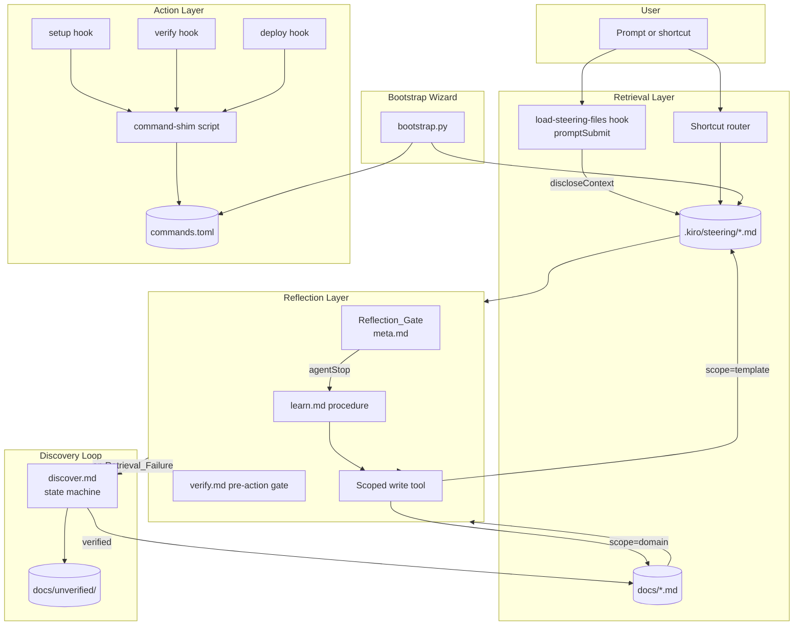
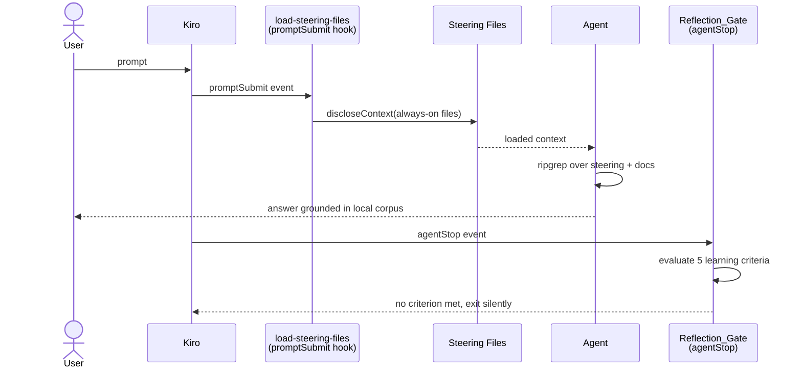
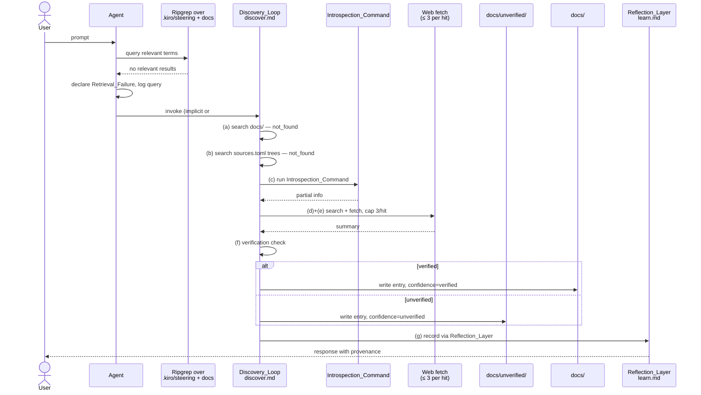
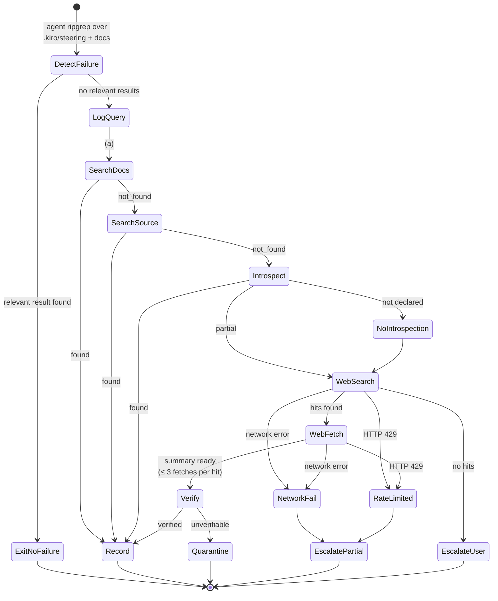
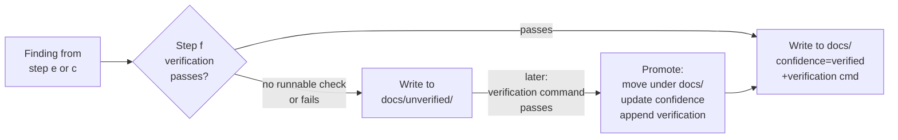

# Design Document

## Overview

The Self-RAG Reflexion Template is a cloneable workspace that wires together three cooperating layers — **Retrieval**, **Reflection**, and **Action** — plus two orthogonal subsystems — the **Discovery_Loop** and the **Bootstrap_Wizard**. The design's load-bearing principle is that the *generic patterns that ship with the template* must stay byte-stable across the lifetime of any Domain_Instance, while *domain-specific learnings* accumulate alongside them under a separate path. Isolation between the two zones is enforced by the `verify` hook, which runs after every Kiro turn and flags any modification to `template/` loudly in the agent's output so the user notices and can revert it. No git dependency, no commit hooks, no filesystem permissions — just a loud post-turn audit.

The design also turns a common anti-pattern in agentic retrieval systems on its head: **reflection is triggered by learning, not by file edits**. A pure Q&A or research turn that discovers something new must still persist what it learned. Conversely, a turn that modifies many files but learned nothing novel must not pollute the doc tree. The Reflection_Gate therefore evaluates five explicit learning criteria on every `agentStop` event, independent of whether any write occurred.

Every doc entry the system writes carries front-matter provenance (`added`, `source`, `confidence`) so that unverified findings from the Discovery_Loop can be quarantined under `docs/unverified/` and only promoted to `docs/` once a runnable verification passes.

Domain-specific behavior — commands, sources, hook bindings — is declared in a small set of TOML files under `.kiro/domain/`. The template never hardcodes a domain command; it resolves them at hook execution time through a typed parser whose round-trip is property-tested.

### Design Goals and Non-Goals

**Goals**

- Domain isolation without git tooling.
- Reflection triggered by self-reported learning signals, not by file-change detection.
- Deterministic, idempotent bootstrap so the same interview inputs always produce the same config files.
- Terminating Discovery_Loop with explicit exits for every step including network and rate-limit failures.
- Full provenance and confidence tracking on every written doc entry.

**Non-Goals**

- No auto-upstreaming mechanism between Domain_Instances and the template (explicitly out of scope per user direction).
- No git hooks, no commit-message parsing, no `.gitattributes` magic.
- No multi-repo federation; the design is scoped to a single repository.

---

## Architecture

### Layer Model



### Normal Turn Sequence

A turn where retrieval succeeds and the agent decides no learning criterion was met.



### Retrieval_Failure → Discovery_Loop → Learn Turn

A turn where local retrieval comes up empty, Discovery_Loop walks the escalation ladder, and the finding is quarantined then verified.



### Key Interactions

- **Retrieval always runs first.** The `load-steering-files` hook fires on `promptSubmit` before the agent sees the user message, so the `inclusion: always` steering files are in context before any tool call.
- **Shortcut routing is distinct from always-on loading.** `#verify`, `#discover`, `#learn`, `#deploy` (plus user-defined shortcuts from Domain_Config) load `inclusion: manual` steering files on demand.
- **The Reflection_Gate is the ONLY writer of doc entries during normal operation.** Direct file writes to `.kiro/steering/` or `docs/` by any other subsystem must go through the scoped write tool defined in `learn.md`.
- **Discovery_Loop hands results to the Reflection_Layer.** The Discovery_Loop never writes doc entries directly; it passes findings to `learn.md`, which applies classification rules, attaches provenance, and performs the scoped write.
- **Isolation enforcement is a two-sided contract.** The write-call `scope` parameter is the *intent* check; the `verify.md` byte-identity diff is the *residual* check that catches intent errors after the fact.

---

## Directory and File Layout

```
<repository-root>/
├── template/                              # Protected, domain-agnostic
│   ├── .kiro/
│   │   ├── steering/
│   │   │   ├── meta.md                    # Reflection_Gate (inclusion: always)
│   │   │   ├── learn.md                   # Write procedure (inclusion: manual, #learn)
│   │   │   ├── verify.md                  # Pre-action gate (inclusion: manual, #verify)
│   │   │   ├── discover.md                # Discovery_Loop (inclusion: manual, #discover)
│   │   │   ├── setup.md                   # Setup guidance (inclusion: fileMatch)
│   │   │   └── deploy.md                  # Deploy workflow (inclusion: manual, #deploy)
│   │   ├── hooks/
│   │   │   ├── load-steering-files.kiro.hook
│   │   │   ├── setup.kiro.hook
│   │   │   ├── verify.kiro.hook
│   │   │   └── deploy.kiro.hook
│   │   └── domain-schema/
│   │       ├── commands.schema.toml       # Reference schema (documentation)
│   │       ├── sources.schema.toml
│   │       └── hooks.schema.toml
│   ├── docs/
│   │   └── README.md                      # Doc-tree conventions
│   ├── tools/
│   │   ├── bootstrap.py                   # Canonical wizard
│   │   ├── command_shim.py                # Hook → commands.toml resolver
│   │   ├── domain_config.py               # Parser + Pretty_Printer
│   │   └── verify_provenance.py           # Used by verify hook
│   └── README.md                          # Template documentation
│
├── .kiro/                                 # Domain_Instance Kiro config
│   ├── domain/
│   │   ├── commands.toml
│   │   ├── sources.toml
│   │   ├── hooks.toml
│   │   └── metadata.toml                  # optional
│   ├── steering/                          # Domain_Instance steering
│   │   ├── meta.md                        # copy of template, may be overridden
│   │   ├── learn.md
│   │   ├── verify.md
│   │   ├── discover.md
│   │   ├── setup.md
│   │   └── deploy.md
│   └── hooks/                             # Copies of template hooks, may be overridden
│       ├── load-steering-files.kiro.hook
│       ├── setup.kiro.hook
│       ├── verify.kiro.hook
│       └── deploy.kiro.hook
│
├── docs/                                  # Domain_Instance verified knowledge
│   ├── <topic>.md
│   └── unverified/                        # Quarantine_Directory
│       └── <finding>.md
│
└── .gitignore                             # Optional convenience, NOT enforcement
```

Notes on the layout:

- **`template/.kiro/` is a mirror, not a symlink.** The Bootstrap_Wizard copies the template steering and hook files into the Domain_Instance `.kiro/`, because Kiro itself reads from `<root>/.kiro/`. The `template/.kiro/` tree exists so the verify hook can diff Domain_Instance files against the pristine template.
- **`template/` is never overwritten by normal reflection.** A write with `scope = "template"` is required and is only issued by `learn.md` when the classification step judges a learning to be generic.
- **`docs/unverified/` is a first-class sibling of `docs/`, not a subdirectory the Reflection_Layer ignores.** Verify hook scans both; promotion rewrites the entry under `docs/` with an updated `confidence` field.

---

## Components and Interfaces

### Retrieval_Layer

**Responsibilities**

- Guarantee steering files marked `inclusion: always` are loaded at the start of every prompt.
- Route shortcut keywords (`#verify`, `#discover`, `#learn`, `#deploy`, plus user-defined) to their steering files.
- Keep retrieval idempotent: re-loading the same set of files mid-session produces the same effective context.

**Interface**

- `load-steering-files.kiro.hook` — Kiro `promptSubmit` hook. Structure mirrors the existing hook in this workspace:

  ```json
  {
    "name": "Load Steering Files",
    "when": { "type": "promptSubmit" },
    "then": {
      "type": "askAgent",
      "prompt": "Before doing anything else, call discloseContext for each of: meta, <always-on list from hooks.toml>. Then follow their instructions."
    }
  }
  ```

- `hooks.toml` declares the always-on steering list under `[retrieval].always_on_steering`. The `load-steering-files` hook reads this list via `command_shim.py` and renders the `askAgent` prompt from a template.
- Shortcut routing lives in `meta.md` as a table: `#verify → verify.md`, `#discover → discover.md`, `#learn → learn.md`, `#deploy → deploy.md`, plus `<user shortcut> → <user steering file>` rows appended from `hooks.toml [retrieval].shortcuts`.

**Kiro front-matter contract**

Each steering file under `.kiro/steering/` carries YAML front-matter:

```yaml
---
inclusion: always | fileMatch | manual
fileMatchPattern: "<glob>"        # required iff inclusion == fileMatch
description: "<one-line summary>"
---
```

### Reflection_Layer

**Responsibilities**

- Run the Reflection_Gate on every `agentStop` event.
- Evaluate the turn against the five learning criteria.
- Classify any learning as generic or domain-specific.
- Call the scoped write tool with `scope = "template"` or `scope = "domain"`.

**Interface**

- `meta.md` contains the Reflection_Gate checklist (see Data Models).
- `learn.md` contains the classification rules and the write procedure.
- `verify.md` contains the pre-action verification checklist the agent works through before calling any external API or command.
- The scoped write tool is a convention on top of the agent's existing file-write tools: the agent must emit a one-line declaration `# scope: template` or `# scope: domain` as the first line of its internal reasoning before the write. A post-turn script (`verify_provenance.py`) can audit this convention but runtime enforcement is through the `verify` hook's byte-identity diff.

### Action_Layer

**Responsibilities**

- Provide `setup`, `verify`, `deploy` hooks bound to the events declared in `hooks.toml`.
- Resolve each hook's command from `commands.toml` at execution time.
- Select the correct OS variant (`posix` or `windows`).
- Skip-and-log when a command is missing or empty.

**Interface**

Each hook file is a thin Kiro `runCommand` hook whose command is `python3 template/tools/command_shim.py <hook-name>` (or the Windows equivalent). The shim reads `commands.toml`, resolves the current OS, and either executes the resolved command or exits zero with a skipped-hook log entry.

```json
{
  "name": "Verify",
  "when": { "type": "agentStop" },
  "then": {
    "type": "runCommand",
    "command": "python3 template/tools/command_shim.py verify"
  }
}
```

The shim's return codes mirror the wrapped command's return codes, so a non-zero exit from `verify` still surfaces to Kiro.

### Discovery_Loop

**Responsibilities**

- Declare Retrieval_Failure when ripgrep over `.kiro/steering/` and `docs/` returns no relevant results for the current question.
- Walk steps (a)–(g) with an explicit exit on each.
- Cap web fetches at three per search hit per invocation.
- Route findings to `docs/unverified/` or `docs/` according to verification outcome.
- Enforce discovery monotonicity: never remove or modify an existing verified entry.

See the detailed state machine in the Discovery_Loop subsection below.

### Bootstrap_Wizard

**Responsibilities**

- Interview the user about the target domain.
- Generate `commands.toml`, `sources.toml`, `hooks.toml` plus an initial steering skeleton.
- Be idempotent: identical inputs produce byte-identical outputs.
- Be invokable from a Kiro `userTriggered` hook, a Kiro spec, or directly as a Python script.

**Interface**

```bash
python3 template/tools/bootstrap.py            # interactive mode
python3 template/tools/bootstrap.py --from-file inputs.toml  # non-interactive
python3 template/tools/bootstrap.py --dry-run  # print files, write nothing
python3 template/tools/bootstrap.py --force    # overwrite without confirmation
```

The Kiro hook and the Kiro spec both shell out to this script; they do not re-implement generation logic.

---

## Data Models

### Domain_Config Schema

All three files share a `schema_version` string at the root. The current version is `"1.0"`.

#### `commands.toml`

```toml
schema_version = "1.0"

[setup]
posix   = "python3 make.py setup"
windows = "python make.py setup"

[verify]
posix   = "python3 make.py verify"
windows = "python make.py verify"

[deploy]
posix   = "python3 make.py deploy"
windows = "python make.py deploy"

# Optional user-defined commands referenced by hooks.toml
[custom.lint]
posix   = "ruff check ."
windows = "ruff check ."
```

| Field | Type | Required | Notes |
|---|---|---|---|
| `schema_version` | string | yes | Semantic version, currently `"1.0"`. |
| `[setup]`, `[verify]`, `[deploy]` | table | yes | Each contains at least one OS variant. |
| `<section>.posix` | string | one-of-required | Command for posix systems. |
| `<section>.windows` | string | one-of-required | Command for Windows. |
| `[custom.<name>]` | table | no | User-defined commands addressable by `hooks.toml`. |

At least one OS variant must be present per required section. If only `posix` is present, Windows hooks skip-and-log; vice versa.

#### `sources.toml`

```toml
schema_version = "1.0"

[[docs]]
name = "my-api-reference"
path = "docs/my-api-reference"
kind = "local"

[[docs]]
name = "upstream-developer-portal"
url = "https://developer.example.com"
kind = "authoritative_web"

[[source_tree]]
name = "my-apps"
path = "."
globs = ["**/*.py", "!**/.venv/**"]

[[introspection]]
query_type = "cli_help"
command = "python3 make.py --help"

[[introspection]]
query_type = "api_schema"
command = "python3 tools/explore_api.py"
```

| Field | Type | Required | Notes |
|---|---|---|---|
| `schema_version` | string | yes | |
| `[[docs]]` | array-of-table | yes, ≥1 | Each has `name`, and one of `path` or `url`, and a `kind` (`local`, `authoritative_web`, `reference_web`). |
| `[[source_tree]]` | array-of-table | no | Local source directories used by Discovery_Loop step (b). |
| `[[introspection]]` | array-of-table | no | `query_type` is a free-form tag the Discovery_Loop dispatches on; `command` is resolved OS-variant-first if the value is a table. |

#### `hooks.toml`

```toml
schema_version = "1.0"

[retrieval]
always_on_steering = ["meta"]
shortcuts = [
    { keyword = "#verify",   steering = "verify" },
    { keyword = "#discover", steering = "discover" },
    { keyword = "#learn",    steering = "learn" },
    { keyword = "#deploy",   steering = "deploy" },
]

[bindings]
setup  = { event = "promptSubmit", command_key = "setup" }
verify = { event = "agentStop",    command_key = "verify" }
deploy = { event = "agentStop",    command_key = "deploy" }

# Optional user-defined bindings
[bindings.lint]
event = "fileEdited"
command_key = "custom.lint"
file_patterns = "**/*.py"
```

| Field | Type | Required | Notes |
|---|---|---|---|
| `schema_version` | string | yes | |
| `[retrieval].always_on_steering` | array of string | yes | File basenames under `.kiro/steering/` without `.md`. |
| `[retrieval].shortcuts` | array of inline table | yes | Each entry has `keyword` (must start with `#`) and `steering`. |
| `[bindings].setup/verify/deploy` | inline table | yes | Each has `event` (one of `promptSubmit`, `agentStop`, `fileEdited`, `fileCreated`, `fileDeleted`, `userTriggered`) and `command_key` (dotted path into `commands.toml`). |
| `[bindings.<custom>]` | table | no | Additional bindings; `file_patterns` required iff `event` is file-based. |

#### `metadata.toml` (optional)

```toml
schema_version = "1.0"
domain_name = "My Domain"
primary_language = "Python 3.11"
bootstrap_date = "2025-01-15"
bootstrap_wizard_version = "1.0"
```

### Typed Domain_Config Dataclasses

`template/tools/domain_config.py` exposes:

```python
from dataclasses import dataclass
from pathlib import Path

@dataclass(frozen=True)
class OSCommand:
    posix: str | None
    windows: str | None

@dataclass(frozen=True)
class Commands:
    schema_version: str
    setup: OSCommand
    verify: OSCommand
    deploy: OSCommand
    custom: dict[str, OSCommand]

@dataclass(frozen=True)
class DocSource:
    name: str
    kind: str  # "local" | "authoritative_web" | "reference_web"
    path: Path | None
    url: str | None

@dataclass(frozen=True)
class SourceTree:
    name: str
    path: Path
    globs: tuple[str, ...]

@dataclass(frozen=True)
class Introspection:
    query_type: str
    command: OSCommand  # string auto-lifted to OSCommand(posix=s, windows=s)

@dataclass(frozen=True)
class Sources:
    schema_version: str
    docs: tuple[DocSource, ...]
    source_tree: tuple[SourceTree, ...]
    introspection: tuple[Introspection, ...]

@dataclass(frozen=True)
class Shortcut:
    keyword: str
    steering: str

@dataclass(frozen=True)
class Binding:
    event: str
    command_key: str
    file_patterns: str | None = None

@dataclass(frozen=True)
class Hooks:
    schema_version: str
    always_on_steering: tuple[str, ...]
    shortcuts: tuple[Shortcut, ...]
    bindings: dict[str, Binding]  # "setup", "verify", "deploy", plus custom

@dataclass(frozen=True)
class DomainConfig:
    commands: Commands
    sources: Sources
    hooks: Hooks
```

All fields are immutable tuples or frozen dataclasses so that parse → pretty-print → parse round-trips through a stable representation.

### Doc Entry Front-Matter Schema

Every file written by the Reflection_Layer or Discovery_Loop under `.kiro/steering/` or `docs/` has this YAML front-matter:

```yaml
---
added: 2025-01-15                          # ISO-8601 date, required
source: tools/explore_api.py                # required
confidence: verified                        # required: "verified" | "unverified"
verification: "python3 tools/explore_api.py status/wan/devices"  # optional; appended on promotion
scope: template                             # optional; "template" | "domain"; used by audit
tags: ["api", "wan"]                        # optional; used by discovery ripgrep
---
```

| Field | Type | Required | Notes |
|---|---|---|---|
| `added` | ISO-8601 date string | yes | `YYYY-MM-DD`. |
| `source` | string | yes | One of: a local path, a shell command, a URL, or the literal token `user`. |
| `confidence` | enum | yes | `verified` or `unverified`. |
| `verification` | string | no | Populated on promotion from `docs/unverified/` to `docs/`. |
| `scope` | enum | no | `template` or `domain`. Absent implies `domain`. |
| `tags` | array of string | no | Free-form retrieval hints. |

The `verify_provenance.py` script walks every `.md` file under `.kiro/steering/` and `docs/` and exits non-zero if any required field is missing or malformed.

### Internal Write-Call Interface

Reflection_Layer writes go through a thin convention expressed in `learn.md`:

```text
WRITE-CALL CONTRACT
-------------------
scope:      "template" | "domain"        (required)
path:       <relative path>              (required)
content:    <file body>                  (required)
front_matter: { added, source, confidence, ... }  (required for docs)
```

Enforcement is two-sided:

1. **Intent check.** Before any write into `.kiro/steering/` or `docs/`, the agent must declare `scope`. The declaration is a line in its internal reasoning; it is mirrored into the front-matter as the optional `scope` field.
2. **Residual check.** The `verify` hook runs `verify_provenance.py`, which checks provenance and runs a byte-identity diff between Domain_Instance steering/docs files and their `template/` counterparts. A match is flagged as a suspected misclassified generic learning and fails the hook.

This contract deliberately avoids git. There is no hook into commit, no `.gitattributes` rule, no commit-message convention.


---

## Discovery_Loop State Machine

The Discovery_Loop is defined in `discover.md` as an explicit state machine with seven steps, each with a defined exit condition. The machine always terminates.

### Trigger Conditions

The Discovery_Loop is entered under exactly two conditions. No other component is allowed to enter it.

| Trigger | Who initiates | Precondition |
|---|---|---|
| **Implicit** | The agent, during a turn | The agent declares `Retrieval_Failure` after ripgrep over `.kiro/steering/` and `docs/` returns no relevant results; the triggering query is logged (Requirement 5.2). |
| **Explicit** | The user | The user issues the shortcut `#discover`; the loop runs even with no prior `Retrieval_Failure` (Requirement 5.10). |

### States and Transitions



### Step-by-Step Contract

| Step | State | Input | Exit Conditions |
|---|---|---|---|
| (a) | `SearchDocs` | query terms | `found` → Record with `source = docs/<path>`; `not_found` → (b) |
| (b) | `SearchSource` | query terms, `sources.toml[[source_tree]]` | `found` → Record with `source = <path>`; `not_found` → (c) |
| (c) | `Introspect` | `query_type` from context, `sources.toml[[introspection]]` | `found` → Record with `source = <command>`; no declared introspection → (d); `partial` → (d) carrying partial info |
| (d) | `WebSearch` | query, `sources.toml[[docs]]` authoritative sources | hits → (e); no hits → `escalate_to_user`; network error → `network_unavailable`; 429 → `rate_limited` |
| (e) | `WebFetch` | up to N hits | summary → (f) (max 3 round-trips per hit); network error → `network_unavailable`; 429 → `rate_limited` |
| (f) | `Verify` | finding, verification hook from introspection or a runnable check | `verified` → (g) with `confidence = verified`; `unverifiable` → (g) with `confidence = unverified` |
| (g) | `Record` | finding, provenance | verified → write to `docs/`; unverified → write to `docs/unverified/`; monotonicity: existing verified entry MUST NOT be removed or modified |

### Termination Invariants

- Every state has a forward-only transition or an exit edge to `[*]`.
- `EscalateUser`, `EscalatePartial`, `Record`, and `Quarantine` all terminate.
- No state transitions back to a prior state. Re-invoking `#discover` starts a fresh machine instance.

### Web-Fetch Budget Accounting

The shared budget is per search hit, per invocation:

```
budget[hit_id] = 3
on each fetch(hit_id):
    if budget[hit_id] == 0: raise BudgetExhausted
    budget[hit_id] -= 1
    result = fetch()
    if result.status == 429: mark_rate_limited(); halt
    if result.network_error: mark_network_unavailable(); halt
    return result
```

A single hit may legitimately require up to three round-trips (initial page, followup link, citation chain) before `Verify` sees the summarized output. The third fetch is the hard cap.

### Quarantine and Promotion Flow



Promotion is explicit — triggered by a later Discovery_Loop invocation that succeeds in step (f) on an existing quarantined entry, or by `verify_provenance.py` when a quarantined entry carries a `verification` command that now exits zero. Promotion never removes provenance; it only updates `confidence` from `unverified` to `verified` and appends the verification command to `source` (Requirement 8.5).

---

## Error Handling

### Hook-Level Errors

| Condition | Detection | Handling |
|---|---|---|
| `commands.toml` missing required key | `command_shim.py` at hook execution | Exit 0 with a `skipped-hook` log line naming the missing key. Kiro does not retry. |
| `commands.toml` parse error | `domain_config.py` parser | Exit non-zero with file, line, and cause; surface to Kiro as hook failure. |
| Wrong OS variant missing | `command_shim.py` | Exit 0 with `skipped-hook`; log entry includes the OS. |
| Wrapped command non-zero exit | `command_shim.py` passes through | Shim preserves the wrapped return code so Kiro sees the failure. |

### Retrieval Errors

| Condition | Detection | Handling |
|---|---|---|
| `discloseContext` call fails for a steering file | Agent response to `load-steering-files` | Log the failure, continue with remaining steering files, surface a warning in the agent reply. |
| Steering file missing front-matter | `verify_provenance.py` | verify hook fails; user fixes the file. |
| Shortcut keyword references a steering file that doesn't exist | Kiro runtime | Agent logs a warning and falls back to a plain-text explanation of the shortcut's intent. |

### Discovery_Loop Errors

Network errors and rate limits are first-class states in the state machine (see above). Additional conditions:

| Condition | Handling |
|---|---|
| `Introspection_Command` hangs | Timeout of 30 seconds, caught by `command_shim.py`; state proceeds to (d). |
| Web search returns only non-authoritative sources | Proceed to (e) but mark each finding `kind = reference_web`; always require Verify before promoting from quarantine. |
| Monotonicity violation attempt | `learn.md` detects an existing verified entry with matching key fields; write is rejected, logged, and the existing entry is referenced in the agent's reply. |

### Reflection_Layer Errors

| Condition | Handling |
|---|---|
| Write target inside `template/` without explicit `scope = "template"` | Redirect to the corresponding Domain_Instance path; log redirection; include the redirect note in the agent's reply. |
| Classification ambiguous between generic and domain-specific | Default to `scope = "domain"`; user can manually promote later via `#learn` with an explicit scope. |
| No learning criterion matched but agent "wants" to write | Write rejected; agent surfaces the intent in its reply so the user can invoke `#learn` manually. |

---

## Correctness Properties

Each property in this list maps to at least one acceptance criterion in `requirements.md` and will be encoded as an executable property test during implementation.

| # | Property | Informal statement | Maps to |
|---|---|---|---|
| P1 | Retrieval idempotence | Loading the always-on steering set N times in one session yields the same effective context as loading it once. | Req 3.5 |
| P2 | Discovery monotonicity | A Discovery_Loop invocation that resolves a question with an existing verified entry in `docs/` does not modify or remove that entry. | Req 5.9 |
| P3 | Provenance preservation | Every file written by the Reflection_Layer or Discovery_Loop has valid `added`, `source`, and `confidence` front-matter. | Req 8.1–8.4, 8.6 |
| P4 | Reflection completeness | Every `agentStop` event runs the Reflection_Gate; no turn exits without evaluating the five learning criteria. | Req 4.2, 4.3 |
| P5 | Fallback termination | Every Discovery_Loop invocation terminates in finitely many steps with one of: `found`, `not_found`, `escalate_to_user`, `network_unavailable`, `rate_limited`. | Req 5.4, 5.5 |
| P6 | Domain isolation | No write with `scope = "domain"` produces a file under `template/`; no byte-identical duplicate of a `template/` file appears in Domain_Instance `.kiro/steering/` or `docs/`. | Req 1.3, 1.4, 1.5, 1.6 |
| P7 | Parser round-trip | For every valid DomainConfig, parse → pretty-print → parse produces an equivalent object. | Req 9.5 |
| P8 | Bootstrap determinism | For identical wizard inputs on an empty repository, generated `.kiro/domain/` contents are byte-identical across invocations. | Req 7.7 |
| P9 | Web-fetch budget safety | Per search hit in a single Discovery_Loop invocation, the count of web round-trips never exceeds 3. | Req 10.3 |
| P10 | Skip-and-log hook safety | A hook with a missing or empty command key exits 0 and emits a `skipped-hook` log entry naming the hook and key. | Req 6.5 |
| P11 | Scope write safety | Any write to `template/` requires `scope = "template"`; any other target defaults to `scope = "domain"` and resolves under the Domain_Instance root. | Req 1.3, 1.4 |

### Property Encoding Notes

- **P1 (Retrieval idempotence)** is tested with Hypothesis strategies generating random valid steering file sets and random load orderings; the effective context is captured as a sorted tuple of `(path, body)` pairs.
- **P2 (Monotonicity)** is tested with an in-memory mock of the docs tree; Hypothesis generates pairs of (pre-existing entry, new Discovery_Loop finding) and asserts the existing entry is unchanged across any interleaving.
- **P5 (Fallback termination)** is tested by model-checking the state machine: the test exhausts all paths from `DetectFailure` to a terminal state, asserting each path is finite.
- **P7 (Parser round-trip)** uses Hypothesis to generate random valid `DomainConfig` objects via a recursive strategy over the dataclass fields.
- **P8 (Bootstrap determinism)** is tested by invoking `bootstrap.py --from-file inputs.toml` twice to different scratch directories and diffing the outputs byte-for-byte.

---

## Testing Strategy

### Test Pyramid

| Layer | Tool | Scope |
|---|---|---|
| Unit (property) | `pytest` + `hypothesis` | Parser, pretty-printer, state machine, scope resolution, front-matter validator. |
| Unit (example) | `pytest` | `command_shim` OS dispatch, `verify_provenance` error messages, `bootstrap` file emission. |
| Integration | `pytest` driving temp dirs | End-to-end bootstrap, end-to-end Reflection_Layer write through `learn.md`, end-to-end Discovery_Loop with a mocked web client. |
| Kiro hook smoke | Manual + scripted | Each of the four template hooks invoked against a scratch Domain_Instance. |

### Property Test Harness

- Tests live under `template/tests/`.
- Properties are grouped by component: `test_domain_config_properties.py`, `test_discovery_state_machine.py`, `test_reflection_scope.py`, `test_bootstrap_determinism.py`.
- Hypothesis settings: `max_examples=200`, `deadline=None` (state-machine tests can be slow), `suppress_health_check=[HealthCheck.too_slow]`.
- A shared `conftest.py` provides fixtures for a sandboxed filesystem layout matching the Directory and File Layout section.

### Sandboxed Filesystem Fixture

```python
@pytest.fixture
def sandbox(tmp_path: Path) -> Sandbox:
    """Create a full template + domain-instance layout under tmp_path."""
    root = tmp_path / "repo"
    (root / "template" / ".kiro" / "steering").mkdir(parents=True)
    (root / "template" / "docs").mkdir(parents=True)
    (root / "template" / "tools").mkdir(parents=True)
    (root / ".kiro" / "domain").mkdir(parents=True)
    (root / ".kiro" / "steering").mkdir(parents=True)
    (root / "docs" / "unverified").mkdir(parents=True)
    # copy the real template files in from the repo under test
    ...
    return Sandbox(root=root)
```

### Mocked Web Client

`template/tests/_fakes/web_client.py` provides a `FakeWebClient` used by Discovery_Loop integration tests. It supports scripted responses for `search`, `fetch`, `429`, `network_error`, and `timeout`, and records every call for per-hit budget assertions.

### Coverage Targets

- Every state transition in the Discovery_Loop state machine covered by at least one integration test.
- Every front-matter field validated by `verify_provenance.py` exercised by at least one positive and one negative test.
- Every hook binding type (`promptSubmit`, `agentStop`, `fileEdited`, `userTriggered`) smoke-tested through `command_shim.py`.

### Test Data Management

- Fixtures use only real data shapes; no fabricated API responses in property tests. Where a real external system would be called, the test uses `FakeWebClient` or a canned TOML file checked into `template/tests/_fixtures/`.
- Bootstrap determinism tests use a checked-in `inputs.toml` file to isolate the determinism claim from environmental variance.

---

## Open Items Deferred to Implementation

- Exact prompt text in `meta.md`, `learn.md`, `verify.md`, `discover.md`, `setup.md`, `deploy.md`. The design fixes *structure* and *contracts*; the wording is a task-time decision informed by real usage in the reference workspace.
- Choice of TOML library. The Python 3.11+ stdlib `tomllib` covers reading; writing requires a third-party library (`tomli-w` or `tomlkit`). `tomlkit` is preferred because it preserves comments and key order, which matters for `P8 (Bootstrap determinism)`.
- Exact file name conventions under `docs/` and `docs/unverified/`. The design mandates front-matter; file naming is left to `learn.md` to specify.
- Whether `meta.md` itself is `inclusion: always` or is reached via a `load-steering-files` askAgent prompt that names it explicitly. Either works; the hooks.toml `[retrieval].always_on_steering` array makes the choice explicit at configuration time.
