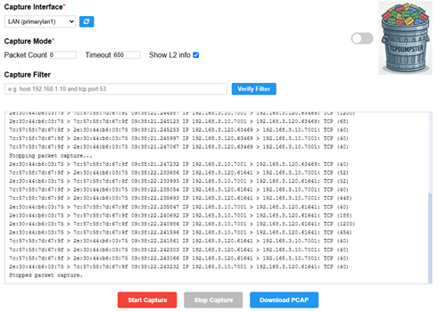
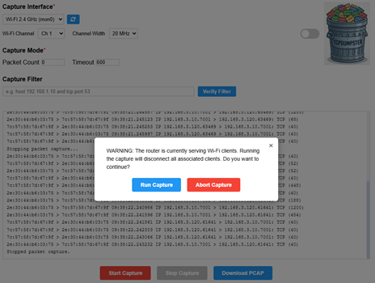
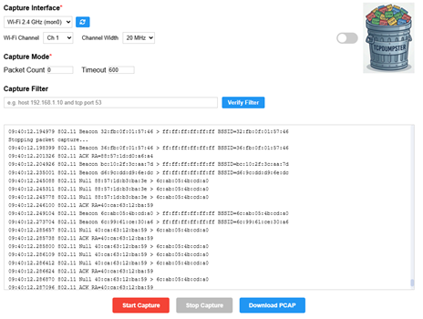
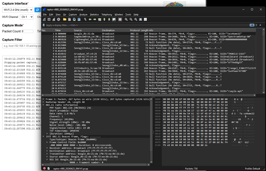

# tcpdumpster

Graphical packet capture interface for Ericsson Cradlepoint routers. Runs as an
NCOS SDK application and provides an HTML-based UI for defining capture parameters,
monitoring live results, and downloading PCAP files.

## Examples

  <a href="./static/tcpdumpster-LAN.png">
  
  
  

## Features

- Live packet display with decoded summaries
- Web UI on TCP port 7001
- Interface selection (WAN, LAN, Wi-Fi monitor, SDWAN)
- Only displays active interfaces
- Refresh for newly activated interfaces
- Configurable packet count and timeout
- BPF capture filter support and verification
- L2 header toggle
- PCAP file download
- Light and dark mode UI toggle

## Usage

Access the UI at `https://<router_ip>:7001` after deploying.

Ensure firewall zone forwarding is configured from Primary LAN Zone to
Router Zone to allow LAN clients to reach port 7001.

## Requirements

- NCOS 7.x or later
- Zone forwarding enabled for port 7001 access from LAN

## Appdata Fields

None required.

## Notes

- The Wi-Fi Channel and Channel Width options are only shown when a Wi-Fi
  monitor interface is selected
- Automatically places Wi-Fi radios in monitor mode as necessary.  Returns the radios to their previous state when capture completes.
- L2 header toggle does not apply to Wi-Fi captures since they are inherently L2 frames.
- Capture filter verification does not process Wi-Fi specific filters.