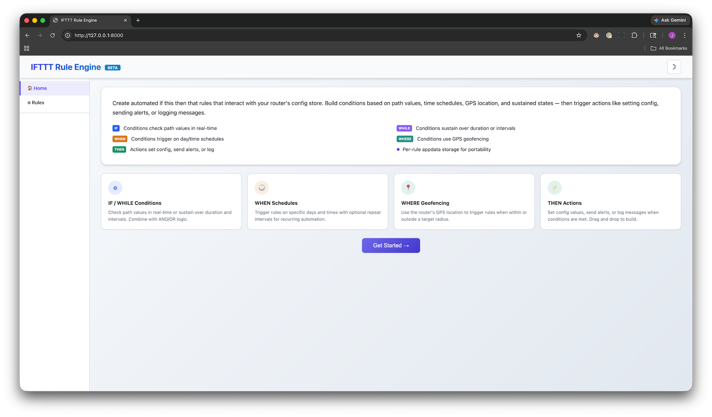
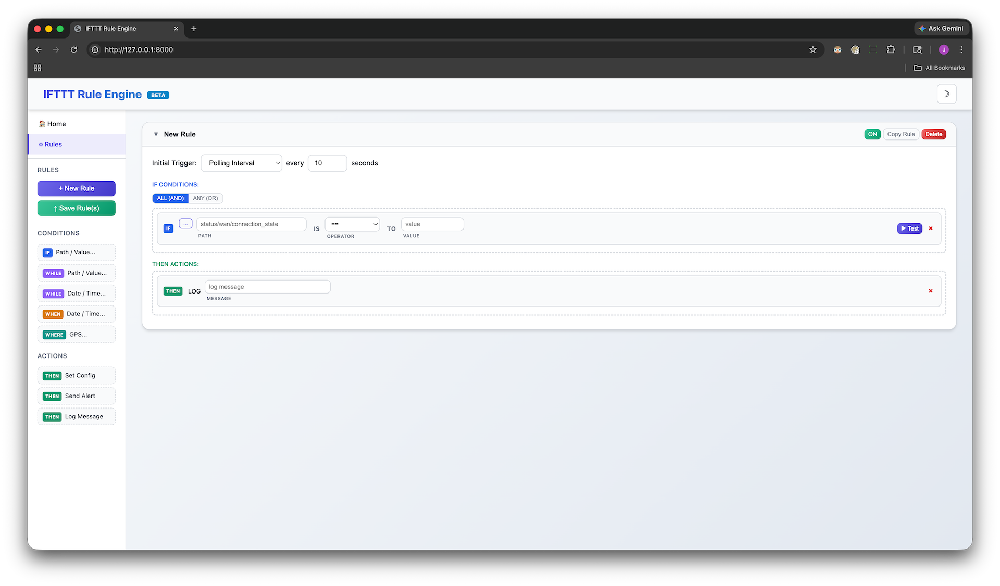
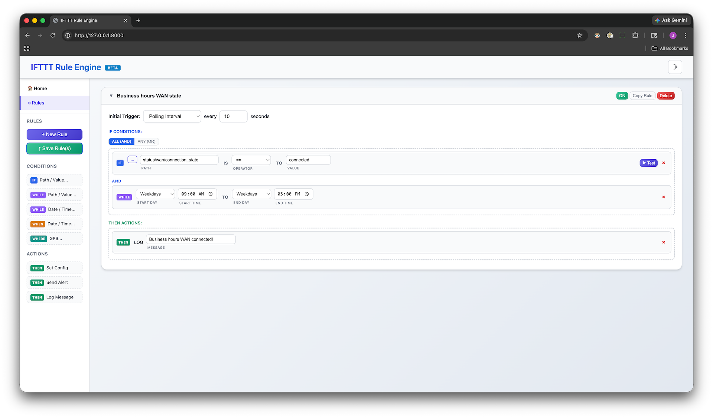
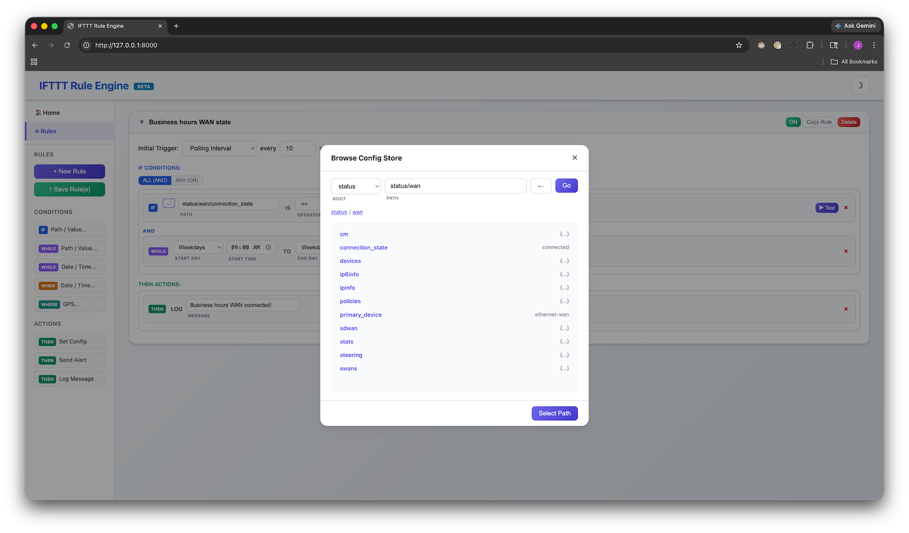
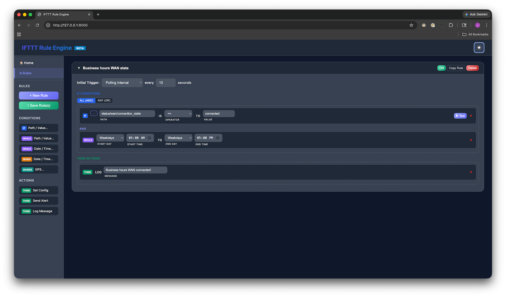

# IFTTT Rule Engine


*IFTTT Rule Engine homepage with condition type badges and feature highlights*

## Table of Contents
- [Overview](#overview)
- [Features](#features)
- [Architecture](#architecture)
- [Prerequisites](#prerequisites)
- [Installation](#installation)
- [Getting Started](#getting-started)
- [Condition Types](#condition-types)
  - [IF — Path / Value](#if--path--value)
  - [WHILE — Path / Value (Sustained)](#while--path--value-sustained)
  - [WHILE — Date / Time Window](#while--date--time-window)
  - [WHEN — Time Schedule](#when--time-schedule)
  - [WHERE — GPS Geofencing](#where--gps-geofencing)
- [Action Types](#action-types)
- [Rule Configuration](#rule-configuration)
  - [Trigger Modes](#trigger-modes)
  - [Logic Modes](#logic-modes)
  - [Sustain Options](#sustain-options)
- [Web Dashboard](#web-dashboard)
- [Data Storage](#data-storage)
- [API Reference](#api-reference)
- [File Reference](#file-reference)
- [Operators](#operators)
- [Troubleshooting](#troubleshooting)
- [FAQ](#faq)

## Overview

The IFTTT Rule Engine is an NCOS SDK application that provides a drag-and-drop web dashboard for creating automated "if this then that" rules on Ericsson/Cradlepoint routers. Rules interact with the router's config and status tree via `cp.py` to monitor conditions and execute actions automatically.

The application runs a web server on port 8000 and supports five condition types (IF, WHILE path, WHILE time, WHEN, WHERE), three action types (Set Config, Send Alert, Log Message), per-rule polling intervals or on-change callbacks, and sustained condition tracking with duration and interval modes.

## Features

### Condition Types
- **IF** — Point-in-time path/value checks against the router config/status tree
- **WHILE (Path)** — Sustained path/value checks with duration or interval requirements
- **WHILE (Time)** — Time window gates with start/end day and time
- **WHEN** — Time-based schedules with day/time and optional repeat intervals
- **WHERE** — GPS geofencing using the router's live location from `status/gps/fix`

### Action Types
- **Set Config** — Write values to the router config tree
- **Send Alert** — Trigger router alerts via `cp.alert()`
- **Log Message** — Write messages to the router log via `cp.log()`

### Rule Engine
- Per-rule enable/disable with visual ON/OFF toggle
- AND/OR logic combining multiple conditions
- Per-rule polling interval (configurable seconds)
- On-change callback trigger mode via `cp.register()`
- Sustained condition tracking (duration in seconds/minutes/hours, or consecutive interval count)
- Auto-start enabled rules on application startup
- Background thread per rule with independent evaluation cycles
- Automatic 1-second polling when sustain timers are active

### Web Dashboard
- Drag-and-drop rule builder with sidebar palette
- Collapsible rule cards with header controls
- Browse Config Store modal with breadcrumb navigation and root selector
- Live condition testing with PASS/FAIL results and actual values
- Copy rule JSON to clipboard for portability
- Toast notifications for all user actions
- Unsaved changes warning banner
- Dark mode with persistent preference
- Homepage with feature overview and condition type badges

## Architecture

```
┌─────────────────────────────────────────────────────────────┐
│                    IFTTT Rule Engine                         │
├─────────────────────────────────────────────────────────────┤
│  Web Dashboard (port 8000)                                  │
│  ├── Homepage (feature overview)                            │
│  ├── Rules Page (drag-and-drop builder)                     │
│  └── Browse Config Store (modal path browser)               │
├─────────────────────────────────────────────────────────────┤
│  Rule Evaluation Engine                                     │
│  ├── Per-rule background threads (polling interval)         │
│  ├── On-change callbacks (cp.register)                      │
│  ├── Condition evaluators (IF/WHILE/WHEN/WHERE)             │
│  ├── Sustain tracking (duration/intervals)                  │
│  └── Action executors (set/alert/log)                       │
├─────────────────────────────────────────────────────────────┤
│  Data Layer                                                 │
│  ├── Per-rule appdata storage (ifttt_rule_<id>)             │
│  └── Router config/status tree (via cp.py)                  │
└─────────────────────────────────────────────────────────────┘
```

### Component Flow

```
Sidebar Palette ──drag──▶ Drop Zone ──save──▶ Appdata
                                                 │
                                          sync_rules()
                                                 │
                              ┌───────────────────┤
                              ▼                   ▼
                     Polling Thread         cp.register()
                     (interval mode)       (callback mode)
                              │                   │
                              ▼                   ▼
                      evaluate_single_rule(rule)
                              │
                    ┌─────────┼─────────┐
                    ▼         ▼         ▼
                IF/WHILE   WHEN      WHERE
                (cp.get)  (datetime) (GPS+haversine)
                    │         │         │
                    └─────────┼─────────┘
                              ▼
                     Sustain check
                    (duration/intervals)
                              │
                              ▼
                     AND/OR logic gate
                              │
                              ▼
                     Execute actions
                   (set / alert / log)
```

## Prerequisites

### Router Requirements
- NCOS firmware 7.25 or higher
- SDK enabled on the router
- `cppython` (Python 3.8 runtime)
- GPS module (for WHERE conditions only)

### Development Requirements (optional)
- Python 3.8+ on workstation
- `sdk_settings.ini` configured for HTTP-to-router development
- Web browser (Chrome, Firefox, Safari, Edge)

## Installation

### Standard Deployment (Router)

1. Build the SDK package:
```bash
# macOS/Linux:
python3 make.py build ifttt
# Windows:
python make.py build ifttt
```

2. Upload to NCM or directly to the router via the SDK Apps interface

3. The app auto-starts and serves the web dashboard on port 8000

### Accessing the Web Interface

**From the router LAN:**
Add a Zone Firewall Forwarding Policy for Primary LAN Zone → Router Zone, set to Allow. Then browse to `http://<router-ip>:8000`.

**Via Remote Connect (NCM):**
Use LAN Manager with HTTP to `127.0.0.1` port `8000`.

### Development Mode (Workstation)

1. Configure `sdk_settings.ini` with your router's IP address

2. Run the application:
```bash
python3 ifttt.py
```

3. Open your browser to `http://localhost:8000`

## Getting Started

1. Open the web dashboard at `http://<router-ip>:8000`
2. Click **Get Started** on the homepage or navigate to **Rules** in the sidebar
3. Click **+ New Rule** to create a rule
4. Drag conditions from the **Conditions** palette into the conditions drop zone
5. Drag actions from the **Actions** palette into the actions drop zone
6. Configure the condition paths, operators, values, and action parameters
7. Use the **Browse Config Store** button (`...`) to explore available paths
8. Click **▶ Test** on any condition to verify it against live router data
9. Toggle the rule **ON** and click **↑ Save Rule(s)**


*Rules page with sidebar palette, expanded rule card, and drag-and-drop builder*

## Condition Types

### IF — Path / Value

Point-in-time check against any path in the router config/status tree. Fires every evaluation cycle when the condition is true. No sustain options — IF conditions are stateless.

| Field | Description |
|-------|-------------|
| Path | Router config/status path (e.g., `status/wan/connection_state`) |
| Operator | Comparison operator (see [Operators](#operators)) |
| Value | Expected value to compare against |

**Constraints:** Unlimited IF conditions per rule.

### WHILE — Path / Value (Sustained)

Sustained path/value check that requires the condition to remain true for a specified duration or number of consecutive polling intervals before the rule fires.

| Field | Description |
|-------|-------------|
| Path | Router config/status path |
| Operator | Comparison operator |
| Value | Expected value |
| Sustain | Duration (seconds/minutes/hours) or Intervals (consecutive count) |

**Constraints:** Maximum one WHILE Path condition per rule.

### WHILE — Date / Time Window

Time window gate that evaluates to true only when the current day and time fall within the configured start and end window. Supports same-day windows, cross-midnight wraps, and different start/end day configurations.

| Field | Description |
|-------|-------------|
| Start Day | Day of week (Any, Mon–Sun, Weekdays, Weekends) |
| Start Time | Window start time (HH:MM) |
| End Day | Day of week for window end |
| End Time | Window end time (HH:MM) |

**Constraints:** Maximum one WHILE Time condition per rule.

### WHEN — Time Schedule

Time-based trigger that fires at a specific day and time, with an optional repeat interval for recurring execution.

| Field | Description |
|-------|-------------|
| Day | Day of week (Any, Mon–Sun, Weekdays, Weekends) |
| Start Time | Trigger time (HH:MM) |
| Interval | Repeat interval value (0 = no repeat) |
| Unit | Repeat unit (Seconds, Minutes, Hours, Days, Weeks, Months) |

When repeat is set to 0, the condition fires once at the configured time (within a 60-second window). When a repeat interval is set, the condition fires at each interval boundary after the start time.

**Constraints:** Maximum one WHEN condition per rule.

### WHERE — GPS Geofencing

Location-based condition that reads the router's GPS coordinates from `status/gps/fix`, converts DMS (degrees/minutes/seconds) format to decimal, and calculates the haversine distance to a target location.

| Field | Description |
|-------|-------------|
| Router GPS | Live device location (click 📍 to fetch) |
| Operator | `Within` or `Not Within` |
| Radius | Distance threshold |
| Unit | `km` or `mi` |
| Target Lat | Target latitude in decimal degrees |
| Target Lon | Target longitude in decimal degrees |
| Sustain | Every Time, Duration, or Intervals |

The GPS coordinate parser handles multiple formats:
- Decimal degrees: `38.894`, `-77.0365`
- Degrees + decimal minutes: `38 53.6440N`
- Degrees + minutes + seconds: `38 53 38.64 N`

**Constraints:** Maximum one WHERE condition per rule.


*Examples of IF, WHILE, WHEN, and WHERE conditions in a rule card*

## Action Types

| Action | Description | Fields |
|--------|-------------|--------|
| **Set Config** | Write a value to the router config tree | Path (with browse), Value |
| **Send Alert** | Trigger a router alert via `cp.alert()` | Message |
| **Log Message** | Write to the router log via `cp.log()` | Message |

## Rule Configuration

### Trigger Modes

Each rule has an **Initial Trigger** setting that determines how conditions are evaluated:

| Mode | Description |
|------|-------------|
| **Polling Interval** | Evaluates conditions every N seconds (configurable per rule, default 10s). When sustain timers are active, polling increases to 1-second intervals automatically. |
| **On Change (cp.on)** | Registers `cp.register('set', path, callback)` for each condition path. The rule evaluates only when a watched path changes. |

> **Note:** Callbacks do not work on all paths. Status paths are generally supported, but some paths and nested objects may not trigger change events. Test your paths before relying on callback mode.

### Logic Modes

| Mode | Behavior |
|------|----------|
| **ALL (AND)** | All conditions must be true (after sustain) for actions to fire |
| **ANY (OR)** | Any single condition being true (after sustain) triggers actions |

### Sustain Options

Sustain options are available on WHILE (path) and WHERE conditions:

| Mode | Description |
|------|-------------|
| **Every Time** | Fire immediately when the condition is true (no sustain requirement) |
| **Duration** | Condition must remain true for N seconds/minutes/hours continuously |
| **Intervals** | Condition must be true for N consecutive polling intervals |

WHILE (path) conditions default to **Duration** sustain. WHERE conditions default to **Every Time**.

> **Note:** Intervals sustain is only available when the trigger mode is set to Polling Interval.

## Web Dashboard

The web dashboard runs on port 8000 and provides two main views:

**Homepage** — Feature overview with color-coded condition type badges (IF, WHILE, WHEN, WHERE, THEN) and highlight cards. Click **Get Started** to navigate to the rules page.

**Rules Page** — Drag-and-drop rule builder with a sidebar palette containing condition and action components. Rules are displayed as collapsible cards with header controls (ON/OFF toggle, Copy Rule, Delete). The sidebar palette sections (Rules, Conditions, Actions) are only visible when on the Rules page.

Additional features:
- **Browse Config Store** — Modal with root path dropdown (config/status/state/control), breadcrumb navigation, back button with history, and auto-population of condition values from leaf nodes
- **Live Testing** — Click **▶ Test** on any path-based condition to see PASS/FAIL with the actual value
- **Copy Rule** — Copies the full rule JSON to clipboard for transfer between routers
- **Dark Mode** — Toggle via the header button, preference persists in `localStorage`
- **Toast Notifications** — Feedback for save, enable/disable, delete, and test actions
- **Unsaved Changes** — Warning banner appears when rules have been modified but not saved


*Browse Config Store modal with root selector, breadcrumbs, and key/value results*


*Full application in dark mode*

## Data Storage

Each rule is stored as an individual appdata entry with the key prefix `ifttt_rule_`. This design provides:

- **No index file** — Rules are discovered by scanning all appdata entries for the prefix
- **Per-rule persistence** — Each rule survives reboots independently
- **Portability** — Copy rule JSON to clipboard and import on another router
- **Clean deletion** — Deleting a rule removes only its appdata entry

### Rule JSON Structure

```json
{
  "id": "rule_1234567890_1",
  "name": "WAN Monitor",
  "enabled": true,
  "logic": "all",
  "trigger": "interval",
  "interval": 10,
  "conditions": [
    {
      "condType": "if",
      "path": "status/wan/connection_state",
      "operator": "equals",
      "value": "connected"
    }
  ],
  "actions": [
    {
      "type": "log",
      "value": "WAN is connected"
    }
  ]
}
```

### Condition Type Schemas

**IF condition:**
```json
{ "condType": "if", "path": "", "operator": "equals", "value": "" }
```

**WHILE (path) condition:**
```json
{ "condType": "while", "path": "", "operator": "equals", "value": "",
  "sustain": "duration", "sustain_value": 5, "sustain_unit": "seconds" }
```

**WHILE (time) condition:**
```json
{ "condType": "while_time", "start_day": "any", "start_time": "09:00",
  "end_day": "any", "end_time": "17:00" }
```

**WHEN condition:**
```json
{ "condType": "when", "day": "any", "time": "00:00",
  "repeat_value": 0, "repeat_unit": "hours" }
```

**WHERE condition:**
```json
{ "condType": "where", "lat": "", "lon": "", "radius": 1,
  "radius_unit": "km", "operator": "within", "sustain": "none" }
```

## API Reference

The application exposes a REST API on port 8000:

| Method | Endpoint | Description |
|--------|----------|-------------|
| `GET` | `/` | Serves the web dashboard (`index.html`) |
| `GET` | `/api/rules` | Returns all rules as a JSON array |
| `POST` | `/api/rules` | Saves all rules (expects JSON array body) |
| `DELETE` | `/api/rules/<rule_id>` | Deletes a single rule by ID |
| `GET` | `/api/browse?path=<path>` | Browses the router config/status tree at the given path |
| `POST` | `/api/test` | Tests a single condition (expects condition JSON body), returns `{ result: bool, actual_value: string }` |

## File Reference

| File | Description |
|------|-------------|
| `ifttt.py` | Main application — HTTP server, rule evaluation engine, condition evaluators, action executors |
| `index.html` | Web dashboard HTML — layout, sidebar, homepage, rules section, browse modal |
| `static/css/style.css` | Stylesheet — light/dark themes, component styles, responsive layout |
| `static/js/script.js` | Frontend JavaScript — rule builder, drag-and-drop, API calls, dark mode, toast notifications |
| `cp.py` | NCOS SDK router library (do not modify) |
| `package.ini` | SDK package metadata (app name, version, firmware requirements) |
| `start.sh` | Startup script (`cppython ifttt.py`) |
| `docs/images/` | Screenshot directory for README documentation |

## Operators

### Path-Based Operators (IF, WHILE path)

| Operator | Display | Description |
|----------|---------|-------------|
| `equals` | `==` | Exact string match |
| `not_equals` | `!=` | Not equal |
| `contains` | `contains` | Value contains substring |
| `not_contains` | `!contains` | Value does not contain substring |
| `greater_than` | `>` | Numeric greater than |
| `less_than` | `<` | Numeric less than |
| `greater_equal` | `>=` | Numeric greater than or equal |
| `less_equal` | `<=` | Numeric less than or equal |
| `exists` | `exists` | Path exists (value field hidden) |
| `not_exists` | `!exists` | Path does not exist (value field hidden) |

### Location Operators (WHERE)

| Operator | Description |
|----------|-------------|
| `within` | Device is within the specified radius of the target |
| `not_within` | Device is outside the specified radius of the target |

## Troubleshooting

| Issue | Solution |
|-------|----------|
| Dashboard not loading | Verify the app is running: check router logs for "Web dashboard running on port 8000" |
| Rules not evaluating | Ensure rules are enabled (ON) and saved. Check router logs for evaluation messages. |
| Callback mode not firing | Not all paths support callbacks. Switch to Polling Interval mode and test the path. |
| GPS condition always fails | Verify the router has a GPS fix: browse `status/gps/fix` in the config store. |
| WHEN condition not triggering | Time conditions use a 60-second match window. Ensure the router's system clock is correct. |
| Sustain never completes | For duration sustain, the condition must remain continuously true. Any false evaluation resets the timer. |
| Browse shows "Error" | The path may not exist or the router may not support that config tree branch. Try a parent path. |
| Changes not persisting | Click **↑ Save Rule(s)** after making changes. The unsaved changes banner indicates pending saves. |

## FAQ

**Q: How many rules can I create?**
A: There is no hard limit. Each rule runs in its own background thread, so resource usage scales with the number of enabled rules.

**Q: Can I use multiple condition types in one rule?**
A: Yes, with constraints. You can have unlimited IF conditions, but only one each of WHEN, WHILE (path), WHILE (time), and WHERE per rule. The UI enforces these limits.

**Q: Do rules survive reboots?**
A: Yes. Rules are stored in SDK appdata which persists across reboots. Enabled rules auto-start when the application launches.

**Q: Can I transfer rules between routers?**
A: Yes. Use the **Copy Rule** button to copy the rule JSON to your clipboard, then paste it into the target router's appdata or import it through the API.

**Q: What happens if a condition path doesn't exist?**
A: The `exists` operator returns false, and all other operators return false when the path cannot be read. The rule continues evaluating other conditions.

**Q: How does the sustain timer work with callback mode?**
A: The Intervals sustain option is only available in Polling Interval mode. Duration sustain works with both modes — the timer starts when the condition first evaluates true and resets if it evaluates false.

**Q: Can I run this on my workstation for development?**
A: Yes. Configure `sdk_settings.ini` with your router's IP and run `python3 ifttt.py`. The app uses `cp.py` which routes API calls to the router over HTTP in development mode.
